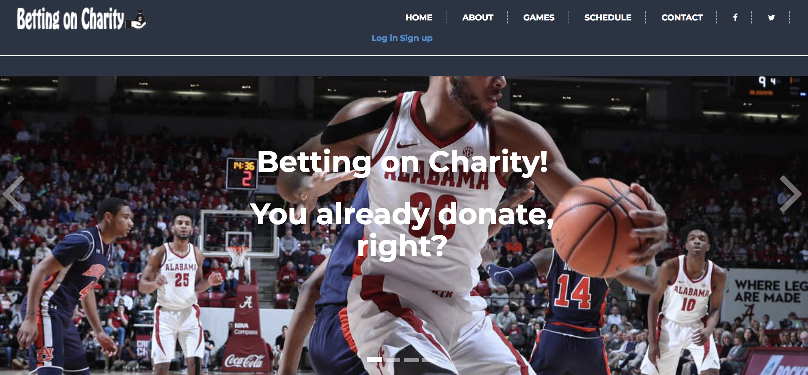
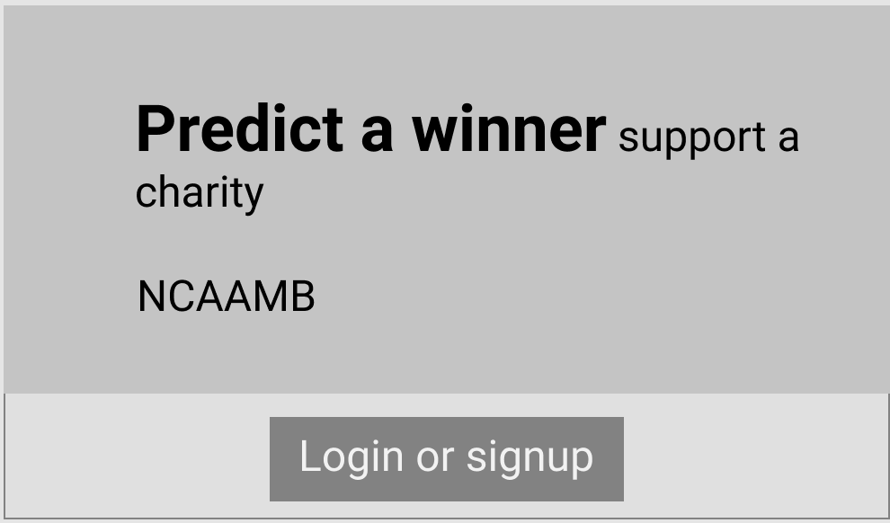
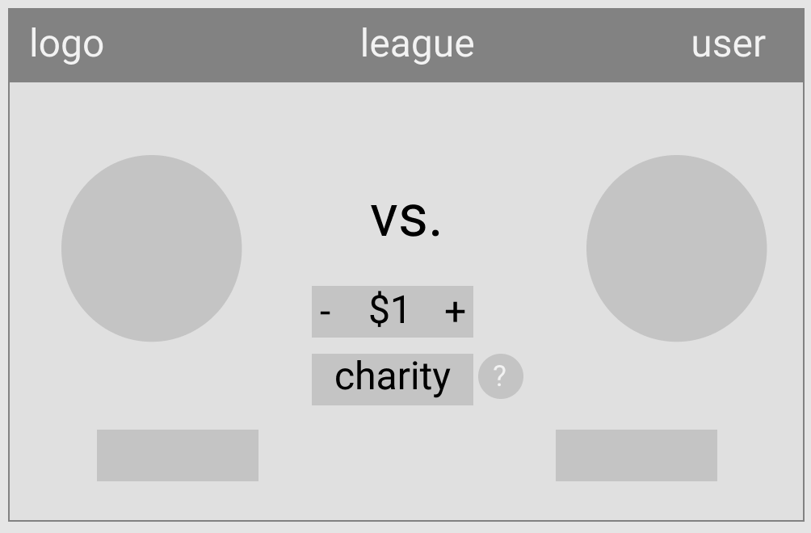

# BettingonCharity.org - a web application for Sports Betting that will donate proceeds to charity.

Initial MVP is to pull March Madness NCAA Mens Basketball games, and create a website with the following:

1.) User Account with validation at registration and on the backend
2.) Models: User, Game, Bet
3.) External API integrated (fantasydata)

## Technologies used:

Mongoose, Express, Node.js, JavaScript, HTML5, CSS3, EJS, jQuery, Git, Github, Heroku

## Process/approach:

Whiteboard basic concept

Create wireframe using Figma





Optimize images and files (compression, minification, etc.)


## Unsolved problems:

Create method to automatically update game winner and send email to winning user.

## Biggest wins and challenges:

Biggest win: Getting fantasydata api key and integrating api call.

Biggest challenge: Integrating front-end via EJS.


## Code Snippets

User signup

```
app.post('/signup', function (req, res) {
  User.register(new User({

          firstname: req.body.firstname,

          lastname: req.body.lastname,

          email: req.body.email ,

          username: req.body.username}),
    req.body.password,
    function (err, newUser) {
      passport.authenticate('local')(req, res, function() {
        res.redirect("/showGames");
      });
    }
  );
});
```

Convert API JSON to Game objects

```function createGamesFromData(json){
  json.Games.forEach(function (game){

    var newGame = new Game({
      user: null,
      email: null,
      gameDay: game.Day,
      gameAwayTeam: game.AwayTeam,
      awayTeamScore: game.AwayTeamScore,
      gameHomeTeam: game.HomeTeam,
      homeTeamScore: game.HomeTeamScore
    });
    newGame.save(function(err, game) {
      if (err) {
        return console.log("save error: " + err);
      }
      console.log("Game saved:", game);

    });

  }) //end forEach
}
```

Seamless use of Bootstrap and Fontawesome
```
<div class="item">
  
  <div class="slide-content extra col-lg-8 col-lg-offset-2 col-md-12 col-sm-12 text-center">
    <h1>Pick a game, pick a charity, make a bet!</h1>
    <h1>You win, and Charity wins!</h1>
    <a href="#" class="button"><span>Read More</span><i class="fa fa-arrow-circle-right"></i></a>
  </div>
</div>
```
